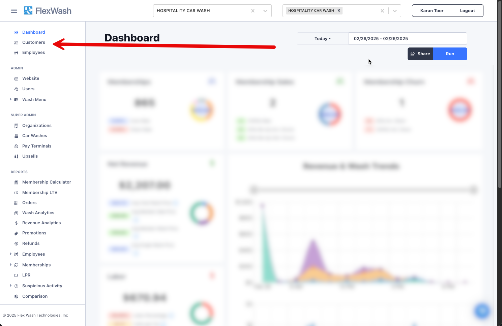

# Find a Customer’s Profile

You can find a customer’s profile on admin in four simple steps.

### 1. Go to the Customers Section

Go to the section titled **“Customers”**, located on the upper left side of your admin’s taskbar.

### 2. Choose a Search Option

You will see this screen pop up. If you click on the dropdown option on the left, you will be able to see the full list of options you have to search a customer’s profile. As shown in the screenshot below, you can find a profile with the customer’s name, phone number, license plate, RFID tag number, email, or the last four digits of their credit card on file.

### 3. Search for the Profile

In this example, we searched for the profile by entering the customer’s name. Instantly, the results will show up below.

### 4. Select the Customer

Once you find the correct customer on the result’s list, simply click on it, and you will be redirected to the customer’s profile. Here, you can edit information like name, email address, phone number, etc. You can also verify if they are enrolled in a membership, recent charges, and the vehicles associated with the customer.

